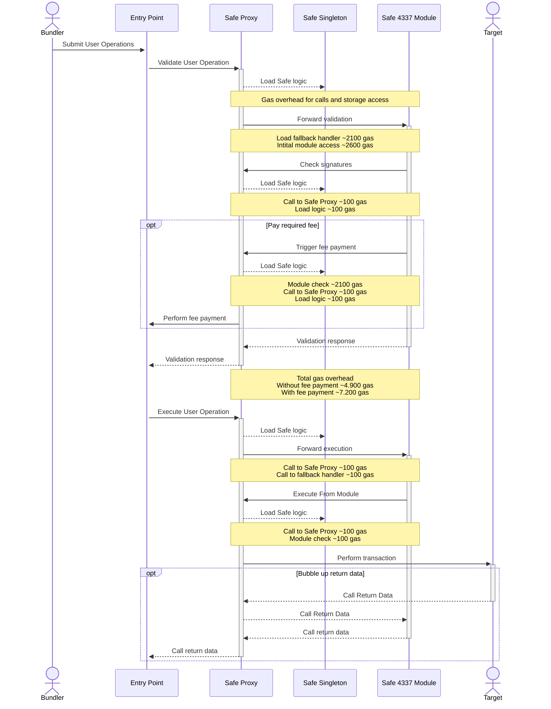
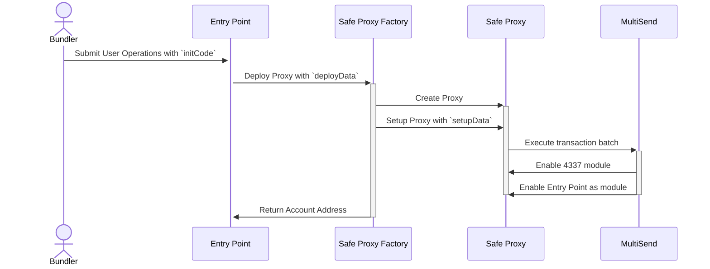

# Safe Module/Fallback handler for EIP4337 Support

:warning: **This module MUST only be used with Safe 1.4.1 or newer** :warning:

## Execution Flow

The diagram below outlines the flow that is triggered when a user operation is submitted to the entrypoint. Additionally the gas overhead compared to a native implementation is mentioned.



The gas overhead is based on [EIP-2929](https://eips.ethereum.org/EIPS/eip-2929). It is possible to reduce the gas overhead by using [access lists](https://eips.ethereum.org/EIPS/eip-2930).

Note: The gas overhead is only the very base line using storage access and call costs. As also additional costs occur to handle the storage access and calls the actual gas overhead is higher. The tests indicate an overhead of ~11.6k gas when a fee payment is required and 7.8k gas otherwise. This shows that there is still room for optimization in the contracts used in the tests.

## Setup Flow

If the Account that the Entry Point should interact with is not deployed yet it is necessary to provide the necessary initialization data (`initCode`) to deploy it.

Important to note that [ERC-4337](https://eips.ethereum.org/EIPS/eip-4337#first-time-account-creation) defined the `initCode` as the following:

> The initCode field (if non-zero length) is parsed as a 20-byte address, followed by "calldata" to pass to this address.

To deploy a Safe with 4337 directly enabled, we require a setup library that enables multiple modules (`AddModulesLib`). This is necessary because to enable a Module, the Safe has to do a call to itself. Before calling the setup method, we do not know the address of the Safe yet (as the address depends on the setup parameters) and using MultiSend will not result in the correct `msg.sender` for a selfcall.

The `initCode` for the Safe with a 4337 module enabled is composed in the following way:

```solidity
/** Enable Modules **/
bytes memory initExecutor = ADD_MODULES_LIB_ADDRESS;
bytes memory initData =  abi.encodeWithSignature("enableModules", [4337_MODULE_ADDRESS, ENTRY_POINT_ADDRESS]);

/** Setup Safe **/
// We do not want to use any payment logic therefore this is all set to 0
bytes memory setupData = abi.encodeWithSignature("setup", owners, threshold, initExecutor, initData, 4337_MODULE_ADDRESS, address(0), 0, address(0));

/** Deploy Proxy **/
bytes memory deployData = abi.encodeWithSignature("createProxyWithNonce", SAFE_SINGLETON_ADDRESS, setupData, salt);

/** Encode for 4337 **/
bytes memory initCode = abi.encodePacked(SAFE_PROXY_FACTORY_ADDRESS, deployData);
```

The diagram below outlines the flow that is triggered by the initialization data to deploy a Safe with the 4337 module enabled.



## Usage

### Install requirements with yarn:

```bash
npm i
```

### Run all tests:

```bash
npm run build
npm run test
```

### Deploy

> :warning: **Make sure to use the correct commit when deploying the contracts.** Any change (even comments) within the contract files will result in different addresses. The tagged versions that are used by the Safe team can be found in the [releases](https://github.com/safe-modules/releases).

This will deploy the contracts deterministically and verify the contracts on etherscan using [Solidity 0.7.6](https://github.com/ethereum/solidity/releases/tag/v0.7.6) by default.

Preparation:

- Set `MNEMONIC` in `.env`
- Set `INFURA_KEY` in `.env`

```bash
npm run deploy-all <network>
```

This will perform the following steps

```bash
npm run build
npx hardhat --network <network> deploy
npx hardhat --network <network> etherscan-verify
npx hardhat --network <network> local-verify
```

### Run script

Preparation:

- Set `DEPLOY_ENTRY_POINT` in `.env`, this should be the entry point supported by the 4337 bundler RPC endpoint that you are connected to.
- Deploy contracts (see _Deploy_ section)
- Set `SCRIPT_*` in `.env`

```bash
npx hardhat run scripts/runOp.ts --network goerli
```

### Compiler settings

The project uses Solidity compiler version `0.8.21` with 10 million optimizer runs, as we want to optimize for the code execution costs. The evm version is set to `paris`, because not all of our target networks support the opcodes introduced in the `Shanghai` EVM upgrade.

After careful consideration, we decided to enable the optimizer for the following reasons:

- The most critical functionality is handled by the Safe and Entrypoint contracts, such as signature checks and replay protection.
- The Entrypoint contract uses the optimizer.

#### Custom Networks

It is possible to use the `NODE_URL` env var to connect to any EVM based network via an RPC endpoint. This connection then can be used with the `custom` network.

E.g. to deploy the Safe contract suite on that network you would run `yarn deploy-all custom`.

The resulting addresses should be on all networks the same.

Note: Address will vary if contract code is changed or a different Solidity version is used.

### Verify contract

This command will use the deployment artifacts to compile the contracts and compare them to the onchain code

```bash
npx hardhat --network <network> local-verify
```

This command will upload the contract source to Etherescan

```bash
npx hardhat --network <network> etherscan-verify
```

## Documentation

- [Safe developer portal](http://docs.safe.global)

## Security and Liability

All contracts are WITHOUT ANY WARRANTY; without even the implied warranty of MERCHANTABILITY or FITNESS FOR A PARTICULAR PURPOSE.

## License

All smart contracts are released under LGPL-3.0
