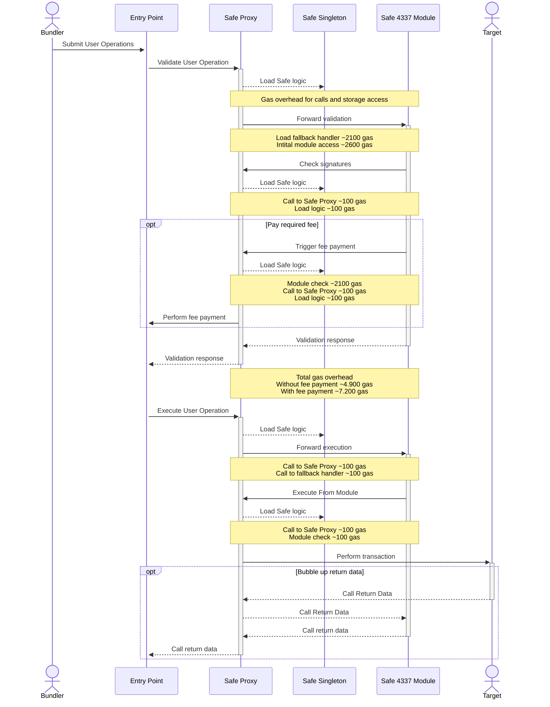
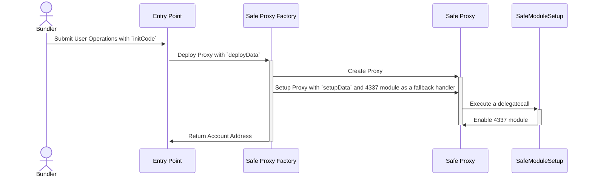

# Safe Module/Fallback handler for ERC-4337 Support

:warning: **This module MUST only be used with Safe 1.4.1 or newer** :warning:

For the supported EntryPoint version, please refer to the [CHANGELOG](./CHANGELOG.md). The module was tested and audited with the EntryPoint version mentioned in the changelog in mind; if you use a different version, you do so at your own risk.

## Execution Flow

The diagram below outlines the flow triggered when a user operation is submitted to the entrypoint. Additionally, the gas overhead compared to a native implementation is mentioned.



The gas overhead is based on [EIP-2929](https://eips.ethereum.org/EIPS/eip-2929). It is possible to reduce the gas overhead by using [access lists](https://eips.ethereum.org/EIPS/eip-2930).

Note: The gas overhead is only the baseline using storage access and call costs. The actual gas overhead is higher as additional costs occur to handle the storage access and calls. The tests indicate an overhead of ~12.1k gas when a fee payment is required and ~10.3k gas otherwise. This shows that there is still room for optimization in the contracts used in the tests.

## Setup Flow

If the Account that the Entry Point should interact with is not deployed yet, it is necessary to provide the required initialization data (`initCode`) to deploy it.

Important to note that [ERC-4337](https://eips.ethereum.org/EIPS/eip-4337#first-time-account-creation) defined the `initCode` as the following:

> The initCode field (if non-zero length) is parsed as a 20-byte address, followed by "calldata" to pass to this address.

To deploy a Safe with 4337 directly enabled, we require a setup contract that enables multiple modules (`SafeModuleSetup`). This is necessary because to enable a Module, the Safe has to do a call to itself. Before calling the setup method, we do not know the address of the Safe yet (as the address depends on the setup parameters) and using MultiSend will not result in the correct `msg.sender` for a selfcall.

The `initCode` for the Safe with a 4337 module enabled is composed in the following way:

```solidity
/** Setup Safe **/
address[] memory modules = new address[](1);
{
    modules[0] = SAFE_4337_MODULE_ADDRESS;
}
bytes memory initializer = abi.encodeWithSignature(
    "setup(address[],uint256,address,bytes,address,address,uint256,address)",
    owners,
    threshold,
    SAFE_MODULE_SETUP_ADDRESS,
    abi.encodeWithSignature("enableModules(address[])", modules),
    SAFE_4337_MODULE_ADDRESS,
    // We do not want to use any refund logic; therefore, this is all set to 0
    address(0),
    0,
    address(0)
);

/** Deploy Proxy **/
bytes memory initCallData = abi.encodeWithSignature(
    "createProxyWithNonce(address,bytes,uint256)",
    SAFE_SINGLETON_ADDRESS,
    initializer,
    saltNonce
);

/** Encode for 4337 **/
bytes memory initCode = abi.encodePacked(SAFE_PROXY_FACTORY_ADDRESS, initCallData);
```

The diagram below outlines the flow triggered by the initialization data to deploy a Safe with the 4337 module enabled.



## Signature encoding

The signatures are encoded as follows:

```solidity
function encodeSignatures(uint48 validUntil, uint48 validAfter, bytes signatures) {
  return abi.encodePacked(validUntil, validAfter, signatures);
}
```

where `validUntil` and `validAfter` are two 48 bit timestamps for signature validity and `signatures` is a concatenated signatures bytes following the Safe encoding, defined [here](https://github.com/safe-global/safe-contracts/blob/915045fcf7e62cc4564c1755b2676b8a2ab22b10/docs/signatures.md).

## Usage

### Install Requirements With PNPM:

```bash
pnpm install
```

### Run Hardhat Integration Tests:

```bash
pnpm test
```

### Run End-to-end Tests:

End-to-end tests with the reference bundler implementation are also provided. These automated tests verify that no user operation validation rules are broken by the implementation. Docker is required to run these tests.

Note: Geth is used as the RPC because the reference bundler implementation relies on Geth-specific tracing APIs.

```bash
pnpm run test:e2e
```

### Run Hardhat Integration and End-to-end Tests:

```bash
pnpm run test:all
```

### Deployments

A collection of the different Safe 4337 modules deployments and their addresses can be found in the [Safe module deployments](https://github.com/safe-global/safe-modules-deployments) repository.

To add support for a new network follow the steps of the Deploy section and create a PR in the [Safe module deployments](https://github.com/safe-global/safe-modules-deployments) repository.

### Deploy

> :warning: **Make sure to use the correct commit when deploying the contracts.** Any change (even comments) within the contract files will result in different addresses. The tagged versions used by the Safe team can be found in the [releases](https://github.com/safe-global/safe-modules/releases).

This will deploy the contracts deterministically and verify the contracts on etherscan and sourcify.

Preparation:

- Set `MNEMONIC` in `.env`
- Set `INFURA_KEY` in `.env`

```bash
pnpm run deploy-all $NETWORK
```

This will perform the following steps

```bash
pnpm run build
npx hardhat --network $NETWORK deploy
npx hardhat --network $NETWORK local-verify
npx hardhat --network $NETWORK etherscan-verify
npx hardhat --network $NETWORK sourcify
```

### Run script

Preparation:

- Set `DEPLOYMENT_ENTRY_POINT_ADDRESS` in `.env`. This should be the entry point supported by the 4337 bundler RPC endpoint you are connected to.
- Deploy contracts (see _Deploy_ section)
- Set `SCRIPT_*` in `.env`

```bash
npx hardhat run scripts/runOp.ts --network goerli
```

### Compiler settings

The project uses Solidity compiler version `0.8.21` with 10 million optimizer runs, as we want to optimize for the code execution costs. The EVM version is set to `paris` because not all our target networks support the opcodes introduced in the `Shanghai` EVM upgrade.

After careful consideration, we decided to enable the optimizer for the following reasons:

- The most critical functionality, such as signature checks and replay protection, is handled by the Safe and Entrypoint contracts.
- The entrypoint contract uses the optimizer.

#### Custom Networks

It is possible to use the `NODE_URL` env var to connect to any EVM-based network via an RPC endpoint. This connection can then be used with the `custom` network.

E.g. to deploy the Safe contract suite on that network, you would run `yarn deploy-all custom`.

The resulting addresses should be on all networks the same.

Note: The address will vary if the contract code changes or a different Solidity version is used.

### Verify contract

This command will use the deployment artifacts to compile the contracts and compare them to the onchain code.

```bash
npx hardhat --network $NETWORK local-verify
```

This command will upload the contract source to Etherscan.

```bash
npx hardhat --network $NETWORK etherscan-verify
```

## Documentation

- [Safe developer portal](http://docs.safe.global)

## Audits

- [For version 0.1.0 by Ackee Blockchain](docs/v0.1.0/audit.md)
- [For version 0.2.0 by Multiple Auditors](docs/v0.2.0/audit.md)
- [For version 0.3.0 by Ackee Blockchain](docs/v0.3.0/audit.md)

## Security and Liability

All contracts are WITHOUT ANY WARRANTY; without even the implied warranty of MERCHANTABILITY or FITNESS FOR A PARTICULAR PURPOSE.

## License

All smart contracts are released under LGPL-3.0-only.
