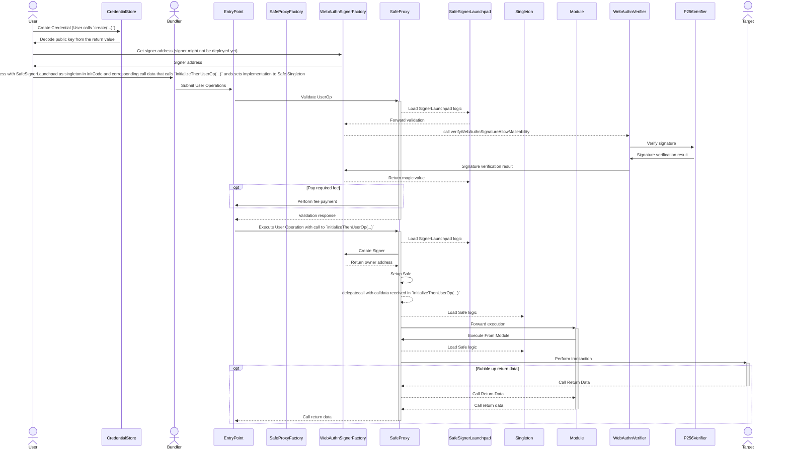

# Passkey

This package contains a passkey signature verifier, that can be used as an owner for a Safe, compatible with versions 1.3.0+.

## Setup and Execution flow

## Security and Liability

All contracts are WITHOUT ANY WARRANTY; without even the implied warranty of MERCHANTABILITY or FITNESS FOR A PARTICULAR PURPOSE.

## License

All smart contracts are released under LGPL-3.0.