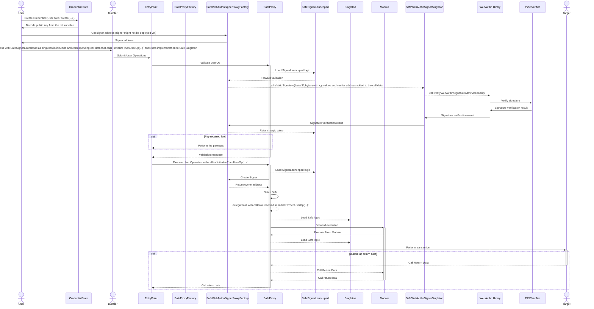

# Passkey

This package contains a passkey signature verifier, that can be used as an owner for a Safe, compatible with versions 1.3.0+.

## SafeWebAuthnSignerProxy

Use of `SafeWebAuthnSignerProxy` provides gas savings compared to the complete bytecode contract for each signer creation. The `SafeWebAuthnSignerProxy` contract is a proxy contract that forwards calls to the `SafeWebAuthnSignerSingleton` contract which is a singleton contract. Both `SafeWebAuthnSignerProxy` and `SafeWebAuthnSignerSingleton` use no storage slots to avoid storage access violations defined in ERC-4337. The details on gas savings can be found in [this PR](https://github.com/safe-global/safe-modules/pull/370).

## Setup and Execution flow



ERC-4337 outlines specific storage access rules for the validation phase, which limits the deployment of SafeProxy for use with the passkey flow. To navigate this restriction, in the `initCode` of UserOp, a `SafeProxy` is deployed with `SafeSignerLaunchpad` as a singleton. The `SafeSignerLaunchpad` is used to validate the signature of the UserOp. The `SafeSignerLaunchpad` forwards the signature validation to the `SafeWebAuthnSignerSingleton`, which in turn forwards the signature validation to the `WebAuthn` library. `WebAuthn` forwards the call to `P256Verifier`. The `P256Verifier` is used to validate the signature. In the validation, phase the launchpad stores the Safe's setup hash (owners, threshold, modules, etc) which is then verified during the execution phase.

During the execution phase, the implementation of the `SafeProxy` is set to the Safe Singleton along with the owner as signer contract deployed by SafeSignerLaunchpad.

## Usage

### Install Requirements With NPM:

```bash
npm install
```

### Run Hardhat Tests:

```bash
npm test
npm run test:4337
```

## Security and Liability

All contracts are WITHOUT ANY WARRANTY; without even the implied warranty of MERCHANTABILITY or FITNESS FOR A PARTICULAR PURPOSE.

## License

All smart contracts are released under LGPL-3.0.
