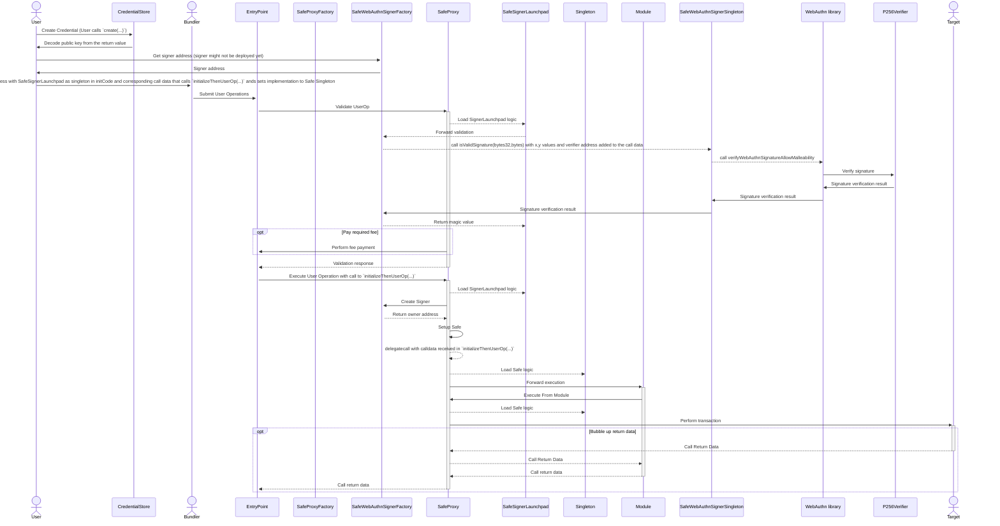

# Passkey

This package contains a passkey signature verifier, that can be used as an owner for a Safe, compatible with versions 1.3.0+.

## Contracts overview

Safe account being standard agnostic, new user flows such as custom signature verification logic can be added/removed as and when required. By leveraging this flexibility to support customizing Safe account, Passkeys-based execution flow can be enabled on a Safe. The contracts in this package use [ERC-1271](https://github.com/frangio/eip712-wrapper-for-eip1271) standard and WebAuthn standard to allow signature verification on SECP256K1 curve. The contracts in this package are designed in such a way that they can be used with precompiles for signature verification in the supported networks or use any verifier contract as a fallback mechanism. In their current state, the contracts are tested with [Fresh Crypto Lib (FCL)](https://github.com/rdubois-crypto/FreshCryptoLib).

The below sections give a high-level overview of the contracts present in this package.

### [SafeWebAuthnSignerProxy](./contracts/SafeWebAuthnSignerProxy.sol)

A proxy contract is uniquely deployed for each Passkey signer. The signer information i.e, Public key co-ordinates, Verifier address, Singleton address are immutable. All calls to the signer are forwarded to the `SafeWebAuthnSignerSingleton` contract.

Use of `SafeWebAuthnSignerProxy` provides gas savings compared to the whole contract deployment for each signer creation. The `SafeWebAuthnSignerProxy` contract is a proxy contract that forwards calls to the `SafeWebAuthnSignerSingleton` contract which is a singleton contract. Both `SafeWebAuthnSignerProxy` and `SafeWebAuthnSignerSingleton` use no storage slots to avoid storage access violations defined in ERC-4337. The details on gas savings can be found in [this PR](https://github.com/safe-global/safe-modules/pull/370). This proxy contract appends public key co-ordinates, and verifier information to the calldata before forwarding call to the singleton contract.

### [SafeWebAuthnSignerSingleton](./contracts/SafeWebAuthnSignerSingleton.sol)

`SafeWebAuthnSignerSingleton` implements ERC-1271 interface to support signature verification which enables signature data to be forwarded from a Safe to the `WebAuthn` library. The `SafeWebAuthnSignerSingleton` contract is a singleton contract that forwards calls to the `WebAuthn` library. This contract expects public key co-ordinates, and verifier address to be appended by the caller inspired from [ERC-2771](https://eips.ethereum.org/EIPS/eip-2771).

### [SafeWebAuthnSignerFactory](./contracts/SafeWebAuthnSignerFactory.sol)

The `SafeWebAuthnSignerFactory` contract is used to deploy the `SafeWebAuthnSignerProxy` contract with the public key co-ordinates and verifier information. The factory contract also supports signature verification for the public-key and signature information without deploying the signer contract which is used during the validation of `UserOp`. Using [ISafeSignerFactory](./contracts/interfaces/ISafeSignerFactory.sol) interface and this factory contract address, new signers can be deployed .

### [WebAuthn](./contracts/WebAuthn.sol)

This library is used for generating signing message, hashing it and forwarding the call to the verifier contract.

## Setup and Execution flow



ERC-4337 outlines specific storage access rules for the validation phase, which limits the deployment of SafeProxy for use with the passkey flow. To navigate this restriction, in the `initCode` of UserOp, a `SafeProxy` is deployed with `SafeSignerLaunchpad` as a singleton. The `SafeSignerLaunchpad` is used to validate the signature of the UserOp. The `SafeSignerLaunchpad` forwards the signature validation to the `SafeWebAuthnSignerSingleton`, which in turn forwards the signature validation to the `WebAuthn` library. `WebAuthn` forwards the call to `P256Verifier`. The `P256Verifier` is used to validate the signature. In the validation, phase the launchpad stores the Safe's setup hash (owners, threshold, modules, etc) which is then verified during the execution phase.

During the execution phase, the implementation of the `SafeProxy` is set to the Safe Singleton along with the owner as signer contract deployed by SafeSignerLaunchpad.

## Usage

### Install Requirements With NPM:

```bash
npm install
```

### Run Hardhat tests:

```bash
npm test
npm run test:4337
```

### Deployments

### Deploy

> :warning: **Make sure to use the correct commit when deploying the contracts.** Any change (even comments) within the contract files will result in different addresses. The tagged versions used by the Safe team can be found in the [releases](https://github.com/safe-global/safe-modules/releases).

This will deploy the contracts deterministically and verify the contracts on etherscan and sourcify.

Preparation:

- Set `MNEMONIC` or `PK` in `.env`
- Set `ETHERSCAN_API_KEY` in `.env`

```bash
npm run deploy-all <network>
```

This will perform the following steps

```bash
npm run build
npx hardhat --network <network> deploy
npx hardhat --network <network> etherscan-verify
npx hardhat --network <network> local-verify
```

#### Custom Networks

It is possible to use the `NODE_URL` env var to connect to any EVM-based network via an RPC endpoint. This connection can then be used with the `custom` network.

E.g. to deploy the contract suite on that network, you would run `npm run deploy-all custom`.

The resulting addresses should be on all networks the same.

Note: The address will vary if the contract code changes or a different Solidity version is used.

### Verify contract

This command will use the deployment artifacts to compile the contracts and compare them to the onchain code.

```bash
npx hardhat --network <network> local-verify
```

This command will upload the contract source to Etherscan.

```bash
npx hardhat --network <network> etherscan-verify
```

### Run benchmark tests

```bash
npm run bench
```

## Security and Liability

All contracts are WITHOUT ANY WARRANTY; without even the implied warranty of MERCHANTABILITY or FITNESS FOR A PARTICULAR PURPOSE.

## User stories

The test cases in [userstories](./test/userstories) directory demonstrates the usage of the passkey module in different scenarios like deploying a Safe account with passkey module enabled, executing a `userOp` with a Safe using Passkey signer, etc.

## License

All smart contracts are released under LGPL-3.0.
