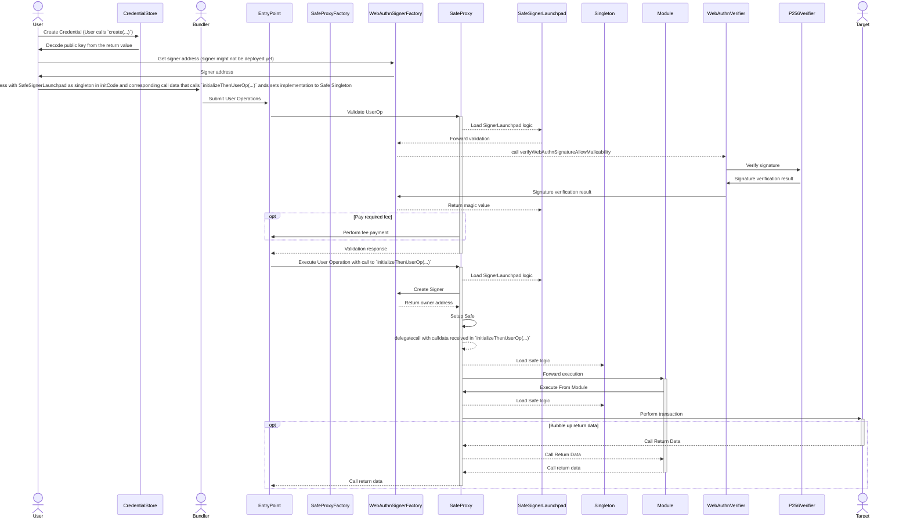

# Passkey

This package contains a passkey signature verifier, that can be used as an owner for a Safe, compatible with versions 1.3.0+.

## Setup and Execution flow



ERC-4337 outlines specific storage access rules for the validation phase, which limits the deployment of SafeProxy for use with the passkey flow. To navigate this restriction, in the `initCode` of UserOp, a SafeProxy is deployed with SafeSignerLaunchpad as a singleton. The SafeSignerLaunchpad is used to validate the signature of the UserOp. The SafeSignerLaunchpad forwards the signature validation to the WebAuthnVerifier, which in turn forwards the signature validation to the P256Verifier. The P256Verifier is used to validate the signature. In the validation, phase the launchpad stores the Safe's setup hash (owners, threshold, modules, etc) which is then verified during the execution phase.

During the execution phase, the implementation of the SafeProxy is set to the Safe Singleton along with the owner as signer contract deployed by SafeSignerLaunchpad.

## Usage

### Install Requirements With NPM:

```bash
npm install
```

### Run Hardhat Tests:

```bash
npm test
npm run test:4337
```

### Deployments

### Deploy

> :warning: **Make sure to use the correct commit when deploying the contracts.** Any change (even comments) within the contract files will result in different addresses. The tagged versions used by the Safe team can be found in the [releases](https://github.com/safe-global/safe-modules/releases).

This will deploy the contracts deterministically and verify the contracts on etherscan and sourcify.

Preparation:

- Set `MNEMONIC` or `PK` in `.env`
- Set `ETHERSCAN_API_KEY` in `.env`

```bash
npm run deploy-all <network>
```

This will perform the following steps

```bash
npm run build
npx hardhat --network <network> deploy
npx hardhat --network <network> etherscan-verify
npx hardhat --network <network> local-verify
```

#### Custom Networks

It is possible to use the `NODE_URL` env var to connect to any EVM-based network via an RPC endpoint. This connection can then be used with the `custom` network.

E.g. to deploy the contract suite on that network, you would run `npm run deploy-all custom`.

The resulting addresses should be on all networks the same.

Note: The address will vary if the contract code changes or a different Solidity version is used.

### Verify contract

This command will use the deployment artifacts to compile the contracts and compare them to the onchain code.

```bash
npx hardhat --network <network> local-verify
```

This command will upload the contract source to Etherscan.

```bash
npx hardhat --network <network> etherscan-verify
```

## Security and Liability

All contracts are WITHOUT ANY WARRANTY; without even the implied warranty of MERCHANTABILITY or FITNESS FOR A PARTICULAR PURPOSE.

## License

All smart contracts are released under LGPL-3.0.
