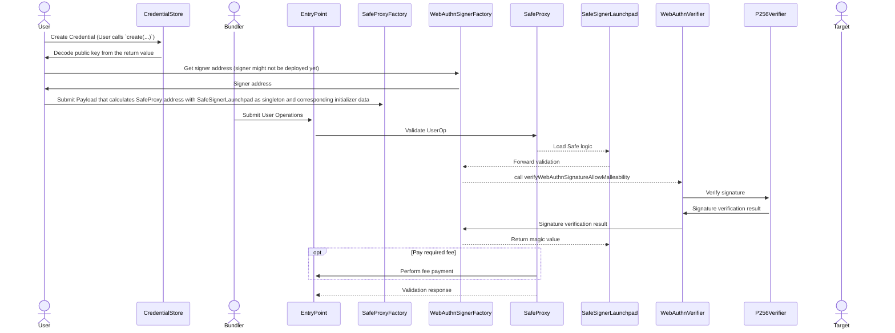

# Passkey

This package contains a passkey signature verifier, that can be used as an owner for a Safe, compatible with versions 1.3.0+.

## Execution flow

```mermaid
sequenceDiagram
actor U as User
participant CS as CredentialStore
actor B as Bundler
participant EP as EntryPoint
participant SPF as SafeProxyFactory
participant WASF as WebAuthnSignerFactory
participant SP as SafeProxy
participant SSL as SafeSignerLaunchpad
participant WAV as WebAuthnVerifier
participant PV as P256Verifier
actor T as Target

U->>+CS: Create Credential (User calls `create(...)`)
CS->>U: Decode public key from the return value
U->>+WASF: Get signer address (signer might not be deployed yet)
WASF->>U: Signer address
U->>+SPF: Submit Payload that calculates SafeProxy address with SafeSignerLaunchpad as singleton and corresponding initializer data
B->>+EP: Submit User Operations
EP->>SP: Validate UserOp
SP-->>SSL: Load Safe logic
SSL-->>WASF: Forward validation
WASF-->>WAV: call verifyWebAuthnSignatureAllowMalleability
WAV->>+PV: Verify signature
PV->>WAV: Signature verification result
WAV->>WASF: Signature verification result
WASF-->>SSL: Return magic value
    opt Pay required fee
        SP->>EP: Perform fee payment
    end
SP-->>EP: Validation response

```
