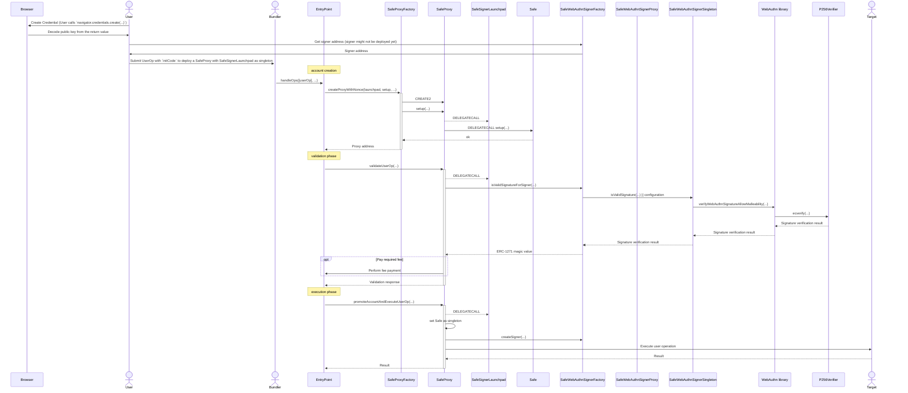

# Passkey 4337 Support

This directory contains additional support contracts for using passkeys with Safes over ERC-4337.

> These contracts are marked as experimental as they are only needed when deploying Safes with initial passkey owners that are required for verifying the very first ERC-4337 user operation with `initCode`. We do not, however, recommend this as it would tie your Safe account's address to a passkey which may not be always available. In particular: the WebAuthn authenticator that stores a device-bound credential that does not allow for backups may be lost, the domain the credential is tied to may no longer be available, you lose access to the passkey provider where your WebAuthn credentials are stored (for example, you no longer have an iPhone or MacBook with access to your iCloud keychain passkeys).
>
> As such, for the moment, we recommend that Safes be created with an ownership structure or recovery mechanism that allows passkey owners to be rotated in case access to the WebAuthn credential is lost.

## Overview

The core contract provided by the `passkey` module is the `SafeWebAuthnSignerFactory` contract which can be used to create smart contract signers that can be used as owners of Safes. These WebAuthn signers are fully supported both with traditional Safe transactions and infrastructure, as well as ERC-4337. In fact, they are designed such that no storage is read during signature verification (all configuration - the WebAuthn credential public key coordinates and the P-256 verifier contract to use) are stored in contract code instead of account storage for compatibility with ERC-4337.

There is one notable caveat when using the `passkey` module with ERC-4337 specifically, which is that ERC-4337 user operations can only deploy exactly one `CREATE2` contract whose address matches the `sender` of the user operation. This means that deploying both the Safe account and its WebAuthn credential owner in a user operation's `initCode` is not possible.

In order to work around this limitation, there are two possible workarounds that can be used:

1. Using a "launchpad" contract, the `SafeSignerLaunchpad`: this implementation provides an alternative `singleton` implementation for the account that is used **only** for the first user operation and makes use of a `ISafeSignerFactory` to validate the WebAuthn signature without deploying the owner in the validation phase of the ERC-4337 user operation (i.e. `validateUserOp`). The WebAuthn owner is then deployed in the execution phase of the user operation, once there are no more restrictions on what is allowed to execute. This implementation allows for 1/1 Safes with a single passkey owner to be able to execute transactions over ERC-4337.
2. Using a shared signer, the `SafeWebAuthnSharedSigner`: this implementation provides a shared signer that can be used as a Safe owner. The shared signer uses account storage for its configuration in order to circumvent any ERC-4337 restrictions on storage during `initCode`. This implementation allows for n/m (including 1/1) Safes with a single passkey owner to be able to execute transactions over ERC-4337. Note that since the signer is a single contract, it can only be used to represent a single passkey owner for any given Safe; however, additional passkey owners can still be added by using the `SafeWebAuthnSignerFactory` to deploy additional WebAuthn signer contracts and adding them as owners to the Safe.

Note that this restriction only applies if **you want to use the passkey module with a Safe over 4337 without any additional EOA owners**. If _any_ of the following applies to you, then the contracts provided in this directory are **not** required:

- You want to deploy a Safe that is also owned by more than `threshold` additional EOA signers, in this case you can use the EOAs to sign the first ERC-4337 user operation that deploys the account and include in the execution phase a call to the `SafeWebAuthnSignerFactory` to deploy the passkey owner.
- You want to deploy the Safe outside of ERC-4337, the WebAuthn signer instance as well as the Safe account can be deployed permissionlessly, so their creation can be batched together in a single transaction when deploying the Safe. Once the Safe and the WebAuthn signer are deployed, they can be used regularly over ERC-4337.
- The passkey owner is already deployed, in this case, the standard ERC-4337 deployment process would apply where you would simply add the already created WebAuthn signer instance as an owner to the Safe.

## [Safe Signer Launchpad](./SafeSignerLaunchpad.sol)

The Safe signer launchpad is used as a `singleton` implementation for the very first user operation. The signature check in the ERC-4337 validation phase is done **without** deploying the WebAuthn signer for the passkey credential using a well-defined `ISafeSignerFactory` interface. In the case the user operation is validated and then executed, the launchpad will:

1. Set the `singleton` to the actual Safe implementation to use
2. Deploy the WebAuthn signer, so that it can be used normally over ERC-4337 for the following user operations

Note that for the very first user operation, an EIP-712 `SafeInitOp` is signed instead of the usual `SafeOp` that is used by the canonical ERC-4337 module. This is done in order to distinguish signatures of a launchpad Safe's user operation from a standard ERC-4337 Safe user operation.

### Init Code Example

The `initCode` should be generated with:

```solitidy
SafeProxyFactory proxyFactory = ...;
SafeSignerLaunchpad launchpad = ...;
Safe singleton = ...;
SafeWebAuthnSignerFactory signerFactory = ...;

uint256 signerX = ...;
uint256 signerY = ...;
uint256 signerVerifiers = ...;

address initializer = ...;
bytes memory initializerData = ...;
address fallbackHandler = ...;

bytes memory initCode = abi.encodePacked(
    proxyFactory,
    abi.encodeCall(
        launchpad.setup,
        (
            address(singleton),
            address(signerFactory),
            signerX,
            signerY,
            signerVerifiers,
            initializer,
            initializerData,
            fallbackHandler
        )
    )
);
```

### User Operation Execution Flow



## [Safe WebAuthn Shared Signer](./SafeWebAuthnSharedSigner.sol)

Alternatively, the shared signer can be used in order as an owner for the Safe. This method is simpler than the launchpad, in that there is no special setup step, and the standard Safe implementation and canonical ERC-4337 module can be used. The only additional requirement is that the Safe `setup` must delegate call into the `SafeWebAuthnSharedSigner` instance in order for it to set its configuration. When paired with the `Safe4337Module`, the `MultiSend` contract can be used to both enable the ERC-4337 support in the Safe as well as configure the WebAuthn credential in the WebAuthn shared signer.

Because the shared signer is a single contract address, it can only ever represent a single passkey owner for Safe. However, additional passkey owners can be added for sWebAuthn signers created with the canonical `SafeWebAuthnSignerFactory` contract, and can even co-exist with the `SafeWebAuthnSharedSigner` owner (so there is no need to re-deploy a signer for the original WebAuthn credential represented by the shared signer).

### Init Code Example

The `initCode` should be generated with:

```solitidy
SafeProxyFactory proxyFactory = ...;
Safe singleton = ...;
SafeWebAuthnSharedSigner sharedSigner = ...;
Safe4337Module safe4337Module = ...;
SafeModuleSetup moduleSetup = ...;
MultiSend multiSend = ...;

uint256 signerX = ...;
uint256 signerY = ...;
uint256 signerVerifiers = ...;

address initializer = ...;
bytes memory initializerData = ...;
address fallbackHandler = ...;

address[] owners memory = [..., address(sharedSigner), ...];
uint256 threshold = ...;

bytes memory configureData = abi.encodeCall(
    sharedSigner.configure,
    (
        signerX,
        signerY,
        signerVerifiers
    )
);

address[] memory modules = new address[](1);
{
    modules[0] = safe4337Module;
}
bytes memory enableModulesData = abi.encodeCall(
    moduleSetup.enableModules,
    (modules)
);

bytes memory initCode = abi.encodePacked(
    proxyFactory,
    abi.encodeCall(
        launchpad.setup,
        (
            owners,
            threshold,
            address(multiSend),
            abi.encodeCall(
                multiSend.multiSend,
                abi.encodePacked(
                    // configure signer
                    uint8(1), // operation
                    address(sharedSigner),
                    uint256(0), // value
                    configureData.length,
                    configureData
                    // enable modules
                    uint8(1), // operation
                    address(moduleSetup),
                    uint256(0), // value
                    enableModulesData.length,
                    enableModulesData
                )
            ),
            address(safe4337Module),
            address(0),
            0,
            address(0)
        )
    )
);
```
